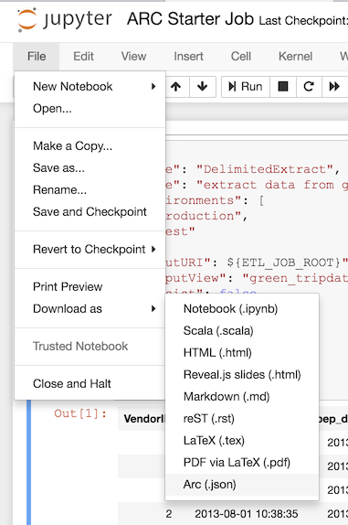

# Arc Starter

A starter project to begin coding an [Arc](https://github.com/tripl-ai/arc) job using the Jupyter Notebook interface see: [Arc-Jupyter](https://github.com/tripl-ai/arc-jupyter).

## Running

Clone this repository then run the included shells script. The user interface will then be available at http://localhost:8888 and the token will be printed to the console.

```bash
./.develop.sh
```

The `.develop.sh` script contains a hard coded memory allocation for [Apache Spark](https://spark.apache.org/) via the Java Virtual Machine which should be configured for your specific environment. e.g. to change from 4 Gigabytes to 8 Gigabytes:

```bash
-e JAVA_OPTS="-Xmx4g" \
```

to 

```bash
-e JAVA_OPTS="-Xmx8g" \
```

## Capabilities

| Magic          | Description                                                                                | Scala 2.11 | Scala 2.12 | numRows | truncate | outputView |
|----------------|--------------------------------------------------------------------------------------------|------------|------------|---------|----------|------------|
| %arc           | Execute an Arc stage. Default.                                                             | ✔          | ✔          | ✔       | ✔        | ✔          |
| %conf          | Set configuration. Default `master=local[*]`, `numRows=20`, `truncate=50`                  | ✔          | ✔          |         |          |            |
| %cypher        | Execute a Cypher query and return resultset.                                               |            | ✔          | ✔       | ✔        | ✔          |
| %env           | Set job variables via the notebook (e.g. `%env ETL_CONF_KEY0=value0 ETL_CONF_KEY1=value1`). Note these are not environment variables so `bash` interpretation (e.g. `$(date "+%Y-%m-%d")`) cannot be used. | ✔          | ✔          |         |          |            |
| %metadata      | Returns the metadata of an input view as a resultset.                                      | ✔          | ✔          | ✔       | ✔        | ✔          |
| %printmetadata | Prints the Arc metadata JSON for the input view.                                           | ✔          | ✔          |         |          |            |
| %printschema   | Prints the Spark schema for the input view as text.                                        | ✔          | ✔          |         |          |            |
| %schema        | Prints the Spark schema for the input view.                                                | ✔          | ✔          |         |          |            |
| %sql           | Execute a SQL query and return resultset.                                                  | ✔          | ✔          | ✔       | ✔        | ✔          |
| %sqlvalidate   | Execute a SQL query as a SQLValidate stage                                                 | ✔          | ✔          | ✔       | ✔        | ✔          |
| %summary       | Returns the summary statistics of an input view as resultset.                              | ✔          | ✔          | ✔       | ✔        | ✔          |
| %version       | Prints the version information of Arc Jupyter.                                             | ✔          | ✔          |         |          |            |


- `numRows` defines the number of rows to return in a result table.
- `truncate` defines the maximum number of characters displayed in a single result cell.
- `outputView` defines the name of a temporary view to register of the resultset.
- `persist` will persist the dataset in memory to speed up use.

### Example

This example shows how to use the `numRows`, `truncate`, `outputView` and `persist` options:

```sql
%sql numRows=10 truncate=100 outputView=green_tripdata0 persist=true
SELECT * 
FROM green_tripdata0_raw
WHERE fare_amount < 10
```

### Magics

These magics can be used to create 'inline SQL' statements that are executed as part of an Arc job.

#### SQLTransform

```sql
%sql name="sqltransform" description="description" environments=production,test outputView=example persist=true sqlParams=inputView=customer,inputField=id
SELECT
    ${inputField}
FROM ${inputView}
```

#### SQLValidate

```sql
%sqlvaildate name="name" description="description" environments=production,test sqlParams=inputView=customer,inputField=id
SELECT
    ${inputField} = 1 AS valid,
    "" AS message
FROM ${inputView}
```

## Exporting

In addition to executing the `.ipynb` file directly an Arc job export option has been provided in the `File\Download as` menu which will export all the Arc stages from the notebook and create a job file. Note that Jupyter Notebooks has been modified so that the `.ipynb` file will not save any `output` datasets to prevent data from being accidentally committed to version control.



## Saving Data with Notebook

By default each time an Arc notebook is saved the data will be removed so it cannot be inadvertently checked in to source control. This can be disabled by passing an environment variable to the docker image like: `-e JUPYTER_SAVE_OUTPUT=true`.

## Issues

**Important:**

If you are running [Docker For Mac](https://docs.docker.com/docker-for-mac/) or [Docker for Windows](https://docs.docker.com/docker-for-windows/) ensure that the Docker memory allocation is large enough to support the memory `-Xmx4g` requested:


## Screenshot


## License

Arc is released under the [MIT License](https://opensource.org/licenses/MIT).
